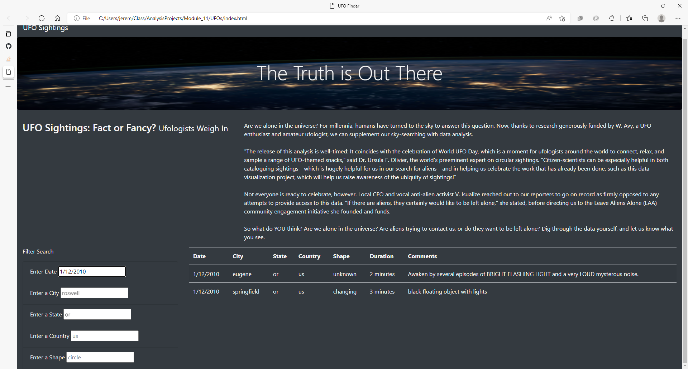

# UFOs
## Overview
The purpose of this project is to assist data journalist, Dana, with modifying a website she has created for an article she has been working on pertaining to UFO sightings. She is from McMinnville, Oregon, which is famous for UFO sightings and this is a topic that interests her. Dana has acquired data stored in a JavaScript array and she would like to incorporate this information into her website. To do this, a table is built from the data in the array and displayed on the website. In addition, using JavaScript, the table is filtered on 5 criteria: Date, City, State, Country, and Shape. The webpage is customized using Bootstrap so that these filters can be applied based on user input. Dana's original webpage's HTML file is modified so that her webpage reflects these changes.  
## Results
The final webpage can be accessed by clicking the following link https://jeremykray.github.io/UFOs/. The webpage that is rendered should look like the image below. , The page includes Dana's article, the full table of data, and the five filters. Simply type in a filter in the appropriate box and hit enter, and the data in the table will be filtered based on the users input. For example, the image below shows the table filtered by the state of Oregon. . This returned 3 records. In the following image, the table is further filtered on date. . The data returned is 2 records, meeting both the state and date criteria.
## Summary
Dana is satisfied with the outcome of her new webpage, but it could still be improved. One drawback of the webpage is that at the end of her article, she asks for user feedback and comments on this controversial topic but there is no avenue within the page for a user to do so. Two recommendations for the page would be:
  1) Include a link at the bottom of the webpage that includes Dana's email or an admin email for the webpage, so that users can contact her with comments
  2) Include a button that takes the user to a "Comments" or "Contact Us" form where the user can leave their name, contact info, and comments.

This way, the Dana ultimately can receive the feedback she wants as a result of this webpage.
